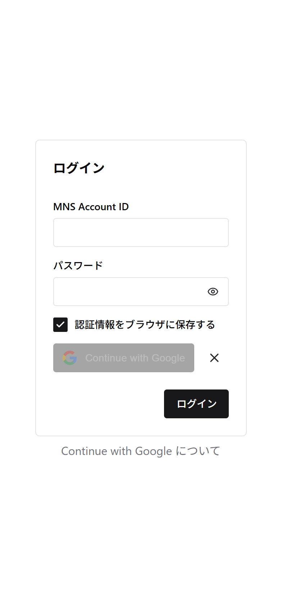
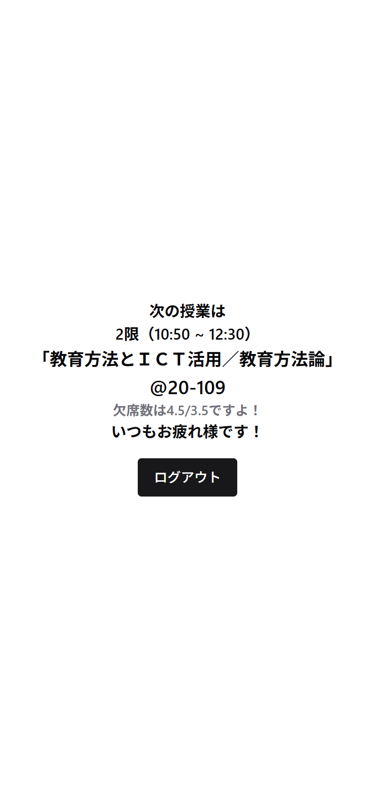

Current Image: <!-- DEPLOY_IMAGE -->nginx-app:17221e0d307415b5ca6ee22cb629b9257139e6e3<!-- /DEPLOY_IMAGE --> 
Image Digest: <!-- DEPLOY_DIGEST -->5b30c3acb43e31b6c4c38f2476aef0d37be8063586cf1ba74b2c2131f04f4520<!-- /DEPLOY_DIGEST -->

# 神奈川大学の学生向け授業・欠席情報一括表示Webアプリ「つぎどこ」

## 概要

「つぎどこ」は、神奈川大学の学生が自分の次の授業に関する情報（休講情報、開講教室、欠席回数）を一目で確認できるWebアプリである。学内ポータルの複雑な画面構成やスマートフォンへの対応の不足といった課題を解消し、限られた教室間の移動時間の中でも迅速に必要な情報へアクセスできるよう設計されている。広いキャンパスや劣悪な通信環境といった神奈川大学特有の環境をふまえ、学生がスムーズに次の授業へ向かえることを目的としている。

## 執筆者

- 森 康太朗

## 背景

神奈川大学の学内ポータルサイトでは、授業に関する情報や欠席回数を確認する際に、画面をスクロールしたり複数のページを移動したりする必要があり、情報へのアクセスが煩雑である。さらに、スマートフォンへの対応も不十分で、外出先や移動中に確認するには不便な設計となっている。

こうした使いづらさは、神奈川大学特有の物理的環境とも重なり、学生にとってより深刻な問題となっている。具体的には、キャンパスの広さや最寄り駅からの距離、さらに利用者が集中する時間帯におけるWi-Fiの通信速度低下などの要因が影響し、教室間の移動時間が限られている中で、学内ポータルから次の授業の情報を迅速に確認することが困難である。

その結果、必要な情報を把握できないまま授業に遅れてしまうケースも見られる。また、事前に教室を把握していても、直前に教室変更が行われることもあり、最新情報の確認は欠かせない。

### チーム

神奈川大学の学生複数名をテストユーザーとしてフィードバックを得ながら、個人で開発を行った。

## 解決手法

学内ポータル（WebStation）からスケジュールを取得した後、現在時刻に基づいて次に受講する授業を自動判別し、以下の情報を取得・表示するWebアプリを製作した。

- 科目名
- 開講教室
- 休講情報
- 欠席回数

フロントエンドにはReact + TypeScript + Chakra UIを採用した。

ログイン画面とメイン画面の2画面によるミニマルな構成とし、スマートフォンでの利用を前提としたレスポンシブデザインを実装している。各画面の情報は、スマートフォンのブラウザの表示領域に収まるよう最適化されている。

シンプルな画面構成のため、React RouterやTan Stackは導入せず、状態管理によるページ切り替えで実装している。

  
  

第三者からの攻撃リスクを軽減するため、バックエンドサーバーを使用せず、リバースプロキシを通じてCORS制限を回避し、フロントエンドが直接学内ポータルから情報を取得する構成とした。ただし、リバースプロキシにおいてSSL/TLS通信の終端処理が行われるため、認証情報の復号化に伴い盗聴のリスクが生じる。このリスクに対処するため、よりセキュアなChainguard社のnginxコンテナイメージを選定し、Google Cloud Run上でサーバーレス環境でリバースプロキシを運用している。

また、学内ポータルから情報を取得するにあたっては学内ポータルのアカウントであるMNS Account IDとパスワードを用いる。MNS Account IDとパスワードは学内の他のサービスでも用いられており、慎重な取り扱いが求められる。一方でユーザの利便性向上には認証情報の保存機能が不可欠であった。

そのため、MNS Account IDとパスワードはブラウザのローカルストレージのみに保存することとした。さらに、XSS攻撃による認証情報の奪取を防ぐため、Google OAuthによる認証を通じてFirestore上に暗号化キーを保管し、ブラウザに保存される認証情報はこのキーを用いて暗号化する仕組みを実装した。

さらに、実装にあたっては、情報取得の頻度を最小化し、取得完了後に自動的にセッションを終了させることで、同時ログイン数の上限というWebステーションの既存の課題も解決している。

> WeBSt@tion（以下、ウェブステ）はシステム正常稼働を担保するため、同時にログインできる人数に制限があります。
> 
> 履修登録作業や成績の閲覧など、利用が終わりましたら、ログアウトをお願いします。
> 
> また、WebClassやシラバス、履修要覧、時間割等を閲覧する際に、ウェブステを介すと、それもログインユーザとして計算されます。
> 
> 他の利用者がログインできないことになりますので、それらについては、本学ホームページ上のバナーからご確認ください。
> 
> ご協力をお願いします。
> 
> 
> 神奈川大学
> 情報システム部/教務課/学生課

### アーキテクチャ図

## 今後の展望

本取り組みにおいて最も評価されるべき点は、その汎用性の高さにあると考える。学内ポータルシステムであるWebStationは、学生生活に必要な情報が集約されている一方、ユーザビリティの低さが課題として指摘されてきた。本取り組みで提案するアーキテクチャを用いることで、セキュリティリスクを最小化しつつ、WebStation上の情報資源を効果的に抽出・活用することが可能となる。

具体的な展開例として、WebStationの掲示板機能の改善が挙げられる。現在、掲示板には検索機能が実装されておらず、学生は必要な情報を探すために膨大な投稿履歴を手動で遡らなければならない。また、新着投稿を既読にした後は、その投稿が他の新着投稿に埋もれてしまい、後から参照することが困難になるという問題も生じている。本アーキテクチャを活用することで、セキュリティリスクを最小化しながら掲示板に検索機能を実装し、これらの課題を解決することができる。

今後は、この汎用的なアーキテクチャを基盤として、掲示板検索機能の実装を第一段階とし、段階的な機能拡張を進めていく予定である。これにより、WebStationの利便性を向上させ、学生の情報収集効率を改善していくことが期待される。

## 参考
[リポジトリ](https://github.com/m-dev672/tugidoko "リポジトリ")
